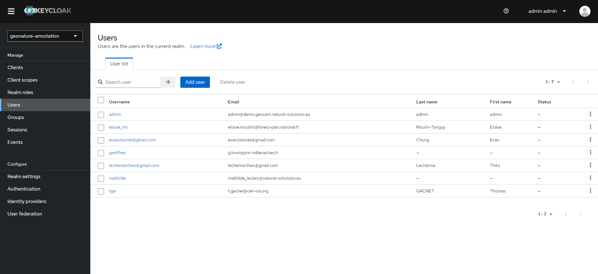
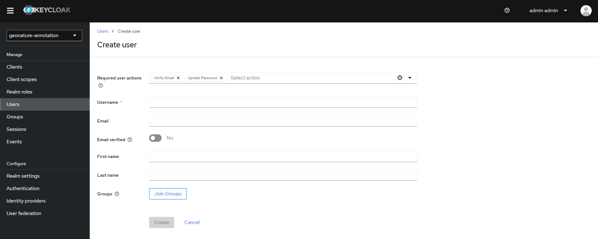

# Utilisation de l'interface d'administration de Keycloak

## Création de compte utilisateur

Vous pouvez créer autant de comptes utilisateur que vous le souhaitez depuis l'onglet _Users_ du menu (accessible sur `/auth/admin/geonature-annotation/console/#/geonature-annotation/users`).

Pour cela :

1. Cliquez sur "Add user"
1. Remplissez les champs obligatoires marqués par une astérisque rouge et le champ email à minima
1. Sélectionnez "Verify email" et "Update password" pour le premier champs (conseillé) comme ci-dessous : 
1. Cliquez sur "Create"
1. Allez dans l'onglet _Credential_, puis cliquez sur "Set password" afin de créer un mot de passe temporaire à changer lors de la première connexion
1. Vérifiez dans l'onglet _Role mapping_ que l'utilisateur a le rôle "default-roles-geonature-annotation"

## Création de compte administrateur

Suivez la même procédure qu'au-dessus pour créer l'utilisateur puis aller dans l'onglet _role mapping_ et attribuer lui le rôle "realm-admin".

## Réinitialisation du mot de passe d'un utilisateur

Dans l'onglet _Users_, sélectionnez sur l'utilisateur concerné, puis dans _Credentials_ cliquez sur "Reset password".

## Gestion des fonctionnalités de connexion

Il est possible de configurer certaines fonctionnalités de la page de connexion dans l'onglet _Login_ comme ci-dessous :

Il y a, par exemple, la possibilité d'activer la fonctionnalité de **mot de passe oublié** et de demande de **création de compte** sur la page de connexion de l'application, comme présenté dans l'exemple ci-dessous.

{ width=350px; align=center}